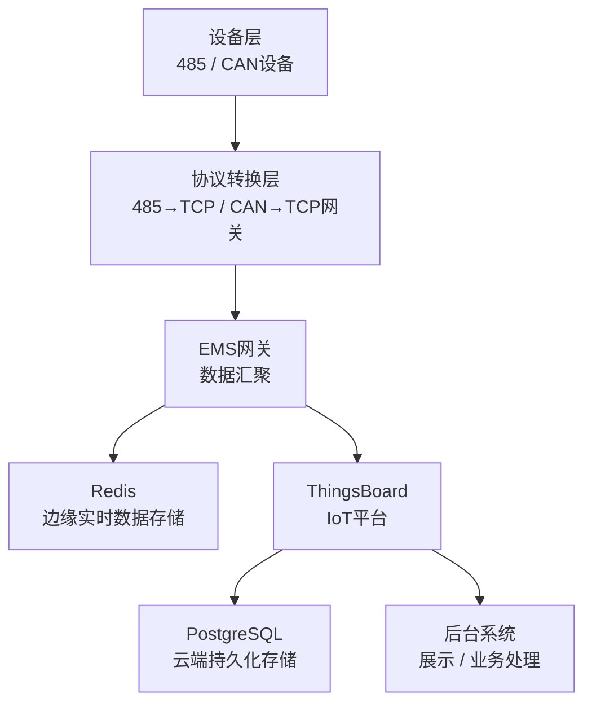

```mermaid
    flowchart TD

    A[设备层<br/>485 / CAN设备]
    B[协议转换层<br/>485→TCP / CAN→TCP网关]
    C[EMS网关<br/>数据汇聚]

    R[Redis<br/>边缘实时数据存储]
    TB[ThingsBoard<br/>IoT平台]
    PG[PostgreSQL<br/>云端持久化存储]

    UI[后台系统<br/>展示 / 业务处理]

    A --> B --> C

    C --> R
    C --> TB

    TB --> PG
    TB --> UI
```